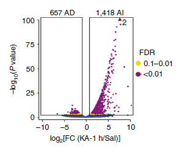
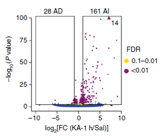
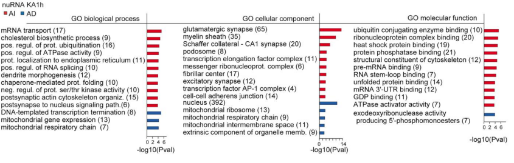
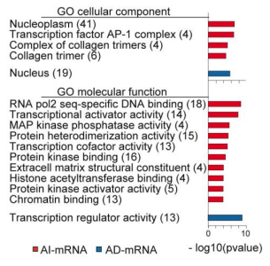

# 2. Methodology and Results

## 2.1. In-vivo nuclear and ribosomal tagging

The data used during this project was obtained from the GEO repository (accesion code GSE125068) provided by the original article [1].

In order to obtain this data, the authors explored different experimental procedures on mice. First, mice were divided into Control and Treated classes, and they measured different cellular parameters on the Control mice (treated with a saline solution) and in the Treated mice after 1 hour, 6 hours and 48 hours of the injection of a Kainic Acid solution (KA). Kainic Acid is a glutamate receptor agonist that is usually used to model an epileptic seizure episode (SE).

Among the original cellular parameters measured by the authors, the ones used for this project are:

-   Sequencing of nuclear RNA

-   Sequencing of ribosomal RNA

-   ATAC sequencing

The cells of interest were obtained after a cellular sorting procedure that relied on the fluorescent tagging of the either the nucleus or the ribosome of the forebrain principal neurons.

During the rest of this project, some of the main results obtained by the authors of the original paper will be discussed and compared to the replicated findings.

## 2.2. What are the most Differentially Expressed Genes?

The first results that will be replicated, answer to the unknown of which genes are the most differentially expressed. To address this question, it has been performed a differential expression analysis following the same procedure than in the original article. After quality control, trimming and aligning the original RNA reads, the matrix count for both the nuclear RNA (nuRNA) and the ribosomal RNA (riboRNA) have been stored in separated files.

The first step to analyze these files is to load the necessary libraries. For this project, the library used to perform the DEX analysis is `DESeq2`, widely use in scientific literature [11].

```{r}
suppressPackageStartupMessages({
  library(ggplot2)
  library(SummarizedExperiment)
  library(DESeq2)
})
```

Now, the files containing the SummarizedExperiment object can be read as follows:

```{r}
nuRNA <- readRDS("RNA/DEA_GSE125068.rds")
riboRNA <- readRDS("RNA/GSE125068_ribo.SE.rds")
```

An overview of what is inside these objects can be obtained just by using the commands:

```{r}
nuRNA
riboRNA
```

As it can be observed, the first SummarizedExperiment object, containing the information of the nuclear RNA sequencing has 6 different assays, where the first of them is the matrix count of the aligned RNA fragments and the second assay is the log-transform of this data. For the case of the second SummarizedExperiment object, related to the ribosomal RNA sequences, only 1 assay is present corresponding to the reads count. 

For both cases the rows of each object contain the name of the genes, while the columns represent each replicate (either Control or Treated).

In the next piece of code a summary of some of the most important variables of the objects are printed.


nuRNA-seq object information:

```{r}
colnames(nuRNA)
nuRNA$Treatment
head(rownames(nuRNA))
```


riboRNA-seq object information:

```{r}
colnames(riboRNA)
riboRNA$condition
head(rownames(riboRNA))
```

In order to work now with the DESeq2 library, it is fundamental to ensure that the objects are in the correct format.

Let's start with the nuRNA object.

For the scope of this analysis, only the Case vs KA Treated (after 1h) data will be considered, so it is needed to discard the rest of the columns of the object. Furthermore, the variable `colData` must be added. `colData` is a data frame with a single field *Treatment* that would state if a certain replicate is a Control case or a Treated case.

```{r}
colData <- data.frame(nuRNA$Treatment[1:4])
rownames(colData) <- colnames(nuRNA)[1:4]
colnames(colData) <- "Treatment"
nuclear_dds<-DESeqDataSetFromMatrix(countData = assay(nuRNA)[, 1:4], design = ~ Treatment, colData = colData)
```

Similarly, these steps must be replicated for the riboRNA object:

```{r}
colData <- data.frame("Treatment" = c("Control", "Control", "Control", "KA", "KA", "KA"))
rownames(colData) <- colnames(riboRNA)
ribo_dds<-DESeqDataSetFromMatrix(countData = round(assay(riboRNA)), design = ~ Treatment, colData = colData)
```

With the DESeq2 object the DESeq function can be now called. It will calculate the p-values of the differential expression of each gene based on the *Treatment* field. Also, a brief summary of the results obtained after the Differential Gene Expression analysis can be printed.

```{r}
nuclear_dds <- DESeq(nuclear_dds)
nuclear_res <- results(nuclear_dds)
summary(nuclear_res)
```

```{r}
ribo_dds <- DESeq(ribo_dds)
ribo_res <- results(ribo_dds)
summary(ribo_res)
```
Finally, to compare the results obtained in this project with the original results provided in [1], two Volcano pltos are presented, one for the nuRNA-seq experiment (Control vs 1 hour KA) and one for the riboRNA-seq experiment (Control vs 1 hour KA).

```{r}
p <- ggplot(data=data.frame(nuclear_res), aes(x=log2FoldChange, y=-log10(pvalue))) + geom_point()
p <- ggplot(data=data.frame(nuclear_res), aes(x=log2FoldChange, y=-log10(pvalue))) + geom_point() + theme_minimal()
p2 <- p + geom_vline(xintercept=c(-0.6, 0.6), col="red") +
    geom_hline(yintercept=-log10(0.05), col="red")


nuclear_res$diffexpressed <- "NO"
# if log2Foldchange > 0.6 and pvalue < 0.05, set as "UP" 
nuclear_res$diffexpressed[nuclear_res$log2FoldChange > 0.6 & nuclear_res$pvalue < 0.01] <- "UP"
# if log2Foldchange < -0.6 and pvalue < 0.05, set as "DOWN"
nuclear_res$diffexpressed[nuclear_res$log2FoldChange < -0.6 & nuclear_res$pvalue < 0.01] <- "DOWN"

# Re-plot but this time color the points with "diffexpressed"
p <- ggplot(data=data.frame(nuclear_res), aes(x=log2FoldChange, y=-log10(pvalue), col=diffexpressed)) + geom_point() + theme_minimal()

p2 <- p + geom_vline(xintercept=c(-0.6, 0.6), col="red") +
        geom_hline(yintercept=-log10(0.05), col="red")

p3 <- p2 + scale_color_manual(values=c("blue", "black", "red"))

mycolors <- c("blue", "red", "black")
names(mycolors) <- c("DOWN", "UP", "NO")
p3 <- p2 + scale_colour_manual(values = mycolors)

nuclear_res$gene_symbol <- rownames(nuclear_res)
nuclear_res$delabel <- NA
nuclear_res$delabel[nuclear_res$diffexpressed != "NO"] <- nuclear_res$gene_symbol[nuclear_res$diffexpressed != "NO"]

ggplot(data=data.frame(nuclear_res), aes(x=log2FoldChange, y=-log10(pvalue), col=diffexpressed)) + 
    geom_point() + 
    theme(plot.title = element_text(hjust = 0.5), plot.caption = element_text(hjust = 0.5)) +
    labs(title = "Differential Gene Expression of nuclear RNA", caption = "Fig 1: Replicated result of the Differential Gene Expression of the nuclear RNAs")
```

For comparison purposes, the results obtained by Fernandez-Albert J. et al. is shown for the case of nuclear RNA-seq.




For the case of the nuclear RNA, the number of upregulated genes found in this analysis is 1232 and the number of downregulated genes is 594. This result is in the same line than the results provided by the original paper, which reported, as shown in Fig 2, a total of 1418 upregulated genes and 657 downregulated genes.

The same comparison for the ribosomal RNA fragments can be done as:

```{r}
p <- ggplot(data=data.frame(ribo_res), aes(x=log2FoldChange, y=-log10(pvalue))) + geom_point()
p <- ggplot(data=data.frame(ribo_res), aes(x=log2FoldChange, y=-log10(pvalue))) + geom_point() + theme_minimal()
p2 <- p + geom_vline(xintercept=c(-0.6, 0.6), col="red") +
    geom_hline(yintercept=-log10(0.05), col="red")


ribo_res$diffexpressed <- "NO"
# if log2Foldchange > 0.6 and pvalue < 0.05, set as "UP" 
ribo_res$diffexpressed[ribo_res$log2FoldChange > 0.6 & ribo_res$pvalue < 0.01] <- "UP"
# if log2Foldchange < -0.6 and pvalue < 0.05, set as "DOWN"
ribo_res$diffexpressed[ribo_res$log2FoldChange < -0.6 & ribo_res$pvalue < 0.01] <- "DOWN"

# Re-plot but this time color the points with "diffexpressed"
p <- ggplot(data=data.frame(ribo_res), aes(x=log2FoldChange, y=-log10(pvalue), col=diffexpressed)) + geom_point() + theme_minimal()

p2 <- p + geom_vline(xintercept=c(-0.6, 0.6), col="red") +
        geom_hline(yintercept=-log10(0.05), col="red")


p3 <- p2 + scale_color_manual(values=c("blue", "black", "red"))

mycolors <- c("blue", "red", "black")
names(mycolors) <- c("DOWN", "UP", "NO")
p3 <- p2 + scale_colour_manual(values = mycolors)


ribo_res$gene_symbol <- rownames(ribo_res)
ribo_res$delabel <- NA
ribo_res$delabel[ribo_res$diffexpressed != "NO"] <- ribo_res$gene_symbol[ribo_res$diffexpressed != "NO"]

ggplot(data=data.frame(ribo_res), aes(x=log2FoldChange, y=-log10(pvalue), col=diffexpressed)) + 
    geom_point() + 
        theme(plot.title = element_text(hjust = 0.5), plot.caption = element_text(hjust = 0.5)) +
    labs(title = "Differential Gene Expression of ribosomal RNA", caption = "Fig 3: Replicated result of the Differential Gene Expression of the ribosomal RNAs")
```

And Fig 4 shows the result reported in the main article.

{width="315"}

In both Fig 2 and Fig 4, the red triangle refers to the number of genes that are outside the range of the image axis.

Following the same analysis as for the case of the nuclear RNA sequences, the number of upregulated genes found in the replication study of the ribosomal RNA sequences is 314 while the number of downregulated genes is 188. This time, the numbers differ more from the original study, which reported 161 upregulated RNA fragments and 28 downregulated RNA fragments.

## 2.3. What is the function of the most Differentially Expressed Genes?

Once the most significant upregulated/downregulated genes are identified, it is intersting to analyse the role that each of these genes plays inside the cell. To address this question, it has been performed an enrichment analysis using the `gprofiler2` library [7] and `PANTHER` database together with `rbioapi`, which allows an easy communication method between R and `PANTHER.db` [9, 10].


```{r}
library(patchwork)
library(PANTHER.db)
library(rbioapi)
```


From the previous section, the names of the upregulated and the downregulated genes can be obtained for the case of the nuclear RNA sequences.

```{r}
up_genes_nuclear <- nuclear_res$gene_symbol[nuclear_res$diffexpressed == "UP"]
down_genes_nuclear <- nuclear_res$gene_symbol[nuclear_res$diffexpressed == "DOWN"]
```

And the same can be done for the ribosomal RNA sequences.

```{r}
up_genes_ribosomal <- ribo_res$gene_symbol[ribo_res$diffexpressed == "UP"]
down_genes_ribosomal <- ribo_res$gene_symbol[ribo_res$diffexpressed == "DOWN"]
```

As in the original article, the Enrichment Analysis is done with `PANTHER`. The calls to the PANTHER database can be done through the `rbioapi` package.

This library allows to perform an enrichment analysis through the command `rba_panther_enrich()`, which would take as inputs the gene names, a code for a reference genome and the type of analysis that will be performed. The following chunk of code provide information about the different analysis that are available in the `rbioapi` package.

```{r}
rbioapi::rba_panther_info(what = "datasets")
```

In this case, only part of the results will be replicated, as only the upregulated genes identified will be studied. The enrichment analysis on the mentioned genes will account for a Molecular Function analysis, a Biological Process analysis and a Cellular Component analysis.

```{r}
rba_options(
  retry_max = 2,
  retry_wait = 10,
  progress = TRUE,
  timeout = 3600,
)

PANTHER_up_nuclear_MF <- rba_panther_enrich(
  up_genes_nuclear,
  10090,
  "ANNOT_TYPE_ID_PANTHER_GO_SLIM_MF",
  cutoff = 0.05)


PANTHER_up_nuclear_BP <- rba_panther_enrich(
  up_genes_nuclear,
  10090,
  "ANNOT_TYPE_ID_PANTHER_GO_SLIM_BP",
  cutoff = 0.05)


PANTHER_up_nuclear_CC <- rba_panther_enrich(
  up_genes_nuclear,
  10090,
  "ANNOT_TYPE_ID_PANTHER_GO_SLIM_CC",
  cutoff = 0.05)
```


```{r, fig.height = 8} 
# out.width= '\\textwidth', fig.height = 8, fig.align='center'}
pbp <- ggplot(head(PANTHER_up_nuclear_BP$result[order(PANTHER_up_nuclear_BP$result$fold_enrichment, decreasing = TRUE), ], 10), aes(-log10(pValue), term.label, size=fold_enrichment, color=number_in_list)) + geom_point() + scale_color_viridis_c() + labs(title = "Enrichment analysis of the most top upregulated genes in the nuRNA-seq analysis", subtitle = "Biological Process Enrichment", caption = "")

pcc <- ggplot(head(PANTHER_up_nuclear_CC$result[order(PANTHER_up_nuclear_CC$result$fold_enrichment, decreasing = TRUE), ], 10), aes(-log10(pValue), term.label, size=fold_enrichment, color=number_in_list)) + geom_point() + scale_color_viridis_c() + labs(title = "", subtitle = "Cellular Component Enrichment", caption = "")


pmf <- ggplot(head(PANTHER_up_nuclear_MF$result[order(PANTHER_up_nuclear_MF$result$fold_enrichment, decreasing = TRUE), ], 10), aes(-log10(pValue), term.label, size=fold_enrichment, color=number_in_list)) + geom_point() + scale_color_viridis_c() + labs(title = "", subtitle = "Molecular Function Enrichment", caption = "Fig 5: nuRNA-seq upregulated genes enrichment analysis")


pbp / pcc / pmf
```

Similar to what it has been done for nuclear RNA fragments, it has been done for the ribosomal RNA fragments: 

```{r}
PANTHER_up_ribo_MF <- rba_panther_enrich(
  up_genes_ribosomal,
  10090,
  "ANNOT_TYPE_ID_PANTHER_GO_SLIM_MF",
  cutoff = 0.05)


PANTHER_up_ribo_BP <- rba_panther_enrich(
  up_genes_ribosomal,
  10090,
  "ANNOT_TYPE_ID_PANTHER_GO_SLIM_BP",
  cutoff = 0.05)


PANTHER_up_ribo_CC <- rba_panther_enrich(
  up_genes_ribosomal,
  10090,
  "ANNOT_TYPE_ID_PANTHER_GO_SLIM_CC",
  cutoff = 0.05)
```


```{r, fig.height=8}
#out.width= '\\textwidth', fig.height = 8, fig.align='center'}
pcc <- ggplot(head(PANTHER_up_ribo_CC$result[order(PANTHER_up_ribo_CC$result$fold_enrichment, decreasing = TRUE), ], 10), aes(-log10(pValue), term.label, size=fold_enrichment, color=number_in_list)) + geom_point() + scale_color_viridis_c() + labs(title = "Enrichment analysis of the most top upregulated genes in the riboRNA-seq analysis", subtitle = "Cellular Component Enrichment", caption = "")

pmf <- ggplot(head(PANTHER_up_ribo_MF$result[order(PANTHER_up_ribo_MF$result$fold_enrichment, decreasing = TRUE), ], 10), aes(-log10(pValue), term.label, size=fold_enrichment, color=number_in_list)) + geom_point() + scale_color_viridis_c() + labs(title = "", subtitle = "Molecular Function Enrichment", caption = "Fig 6: riboRNA-seq upregulated genes enrichment analysis")

pcc / pmf
```


For reference, the results original study are shown.

 

