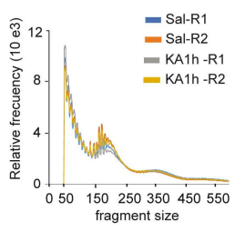
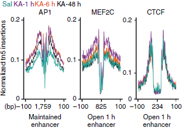
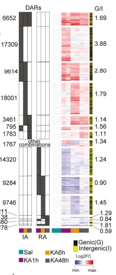
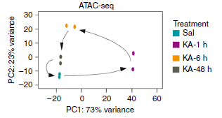

## 2.4. ATAC-seq Data Acquisition & Processing

Once the transcriptome has been analyzed, ATAC-seq data is going to be processed. The main objective of this section is to obtain and process the ATAC-seq data that will be furhter used to study the changes occurring in the DNA accessibility under the SE condition.

To do so, the first thing we need to do is to load the libraries we will be using in this section. 

```{r}
suppressPackageStartupMessages({
  library(AnnotationHub)
  library(Rsubread)
  library(rtracklayer)
  library(Biostrings)
  library(Rfastp)
  library(epiwraps)
  library(ensembldb)
})
```

### a. Download data and fastq extraction

The ATAC data can be obtained from the GEO database with the accession code GSE125068. This data must be downloaded using the `sratoolkit`, which can be obtained through the following link: 

```{bash, eval = FALSE}
wget http://ftp-trace.ncbi.nlm.nih.gov/sra/sdk/current/sratoolkit.current-ubuntu64.tar.gz
tar xzvf sratoolkit.current-ubuntu64.tar.gz
```

Once `sratoolkit` is available, we proceed to download the ATAC data. In summary, the relation between the replicates and the accession codes are: 
-   SRR8441346                --> Saline condition. Replicate 1
-   SRR8441347 & SRR8441348   --> Saline condition. Replicate 2
-   SRR8441349                --> KA condition (1h). Replicate 1
-   SRR8441350 & SRR8441351   --> KA condition (1h). Replicate 2
-   SRR8441352                --> KA condition (6h). Replicate 1
-   SRR8441353                --> KA condition (6h). Replicate 2
-   SRR8441354                --> KA condition (48h). Replicate 1
-   SRR8441355                --> KA condition (48h). Replicate 2

The `.sra` files are compressed folders that contain the information of the reads for each experiment. These files can be obtained through the `prefetch` command.

```{bash engine.opts='-l', eval=FALSE}
for i in SRR8441346 SRR8441347 SRR8441348 SRR8441349 SRR8441350 SRR8441351 SRR8441352 SRR8441353 SRR8441354 SRR8441355
do
   prefetch $i
done
```

However, not every `.sra` file might be available at the time of the request. To solve this problem with the accessibility of the data, the files can be directly retrieved using the following links: 

```{r, eval=FALSE}
options(timeout=1000)
download.file('https://sra-pub-run-odp.s3.amazonaws.com/sra/SRR8441350/SRR8441350', "data/sra/SRR8441350.sra")
download.file('https://sra-pub-run-odp.s3.amazonaws.com/sra/SRR8441352/SRR8441352', "data/sra/SRR8441352.sra")
```

As shown, for the case of this project both the file `SRR8441350.sra` and the file `SRR8441352.sra` were not available at the time of the request. 

Once the compressed file is available, it can be decompressed using the `fasterq-dump` command: 

```{bash engine.opts='-l', eval=FALSE}
mkdir -p raw

for current in SRR8441346 SRR8441347 SRR8441348 SRR8441349 SRR8441350 SRR8441351 SRR8441352 SRR8441353 SRR8441354 SRR8441355
do
fasterq-dump $current --split-files --outdir raw
done
```

Notice that there are some replicates which information have been splitted into two different files. With this chunk of code, the reads of the same replicate can concatenated to analyze them at once. 

```{bash engine.opts='-l', eval=FALSE}
cd raw

cat SRR84SRR8441347_1.fastq SRR84SRR8441348_1.fastq > SRR84SRR8441347_8_1.fastq
cat SRR84SRR8441347_2.fastq SRR84SRR8441348_2.fastq > SRR84SRR8441347_8_2.fastq

cat SRR84SRR8441350_1.fastq SRR84SRR8441351_1.fastq > SRR84SRR8441350_1_1.fastq
cat SRR84SRR8441350_2.fastq SRR84SRR8441351_2.fastq > SRR84SRR8441350_2_2.fastq

rm SRR84SRR8441347_1.fastq
rm SRR84SRR8441348_1.fastq
rm SRR84SRR8441347_2.fastq
rm SRR84SRR8441348_2.fastq

rm SRR84SRR8441350_1.fastq
rm SRR84SRR8441350_1.fastq
rm SRR84SRR8441351_2.fastq
rm SRR84SRR8441351_2.fastq
```

### b. Trimming

The next step is to discard the low quality reads from the raw data, and this is done through the `trimmomatic` tool, which allow the trimming of Illumina NGS data. This step assumes that the file `TruSeqPE.fa` is available, which contains the information about the adapters of the Illumina platform. 

```{bash engine.opts='-l', eval=FALSE}
mkdir -p trimmed
trimmomatic PE -threads 10 raw/SRR8441346_1.fastq raw/SRR8441346_2.fastq trimmed/SRR8441346_1_paired.fastq trimmed/SRR8441346_1_unpaired.fastq trimmed/SRR8441346_2_paired.fastq trimmed/SRR8441346_2_unpaired.fastq ILLUMINACLIP:TruSeqPE:2:15:4:4:true LEADING:20 TRAILING:20 SLIDINGWINDOW:4:20 MINLEN:25
```

```{bash engine.opts='-l', eval=FALSE}
trimmomatic PE -threads 10 raw/SRR8441347_8_1.fastq raw/SRR8441347_8_2.fastq trimmed/SRR8441347_8_1_paired.fastq trimmed/SRR8441347_8_1_unpaired.fastq trimmed/SRR8441347_8_2_paired.fastq trimmed/SRR8441347_8_2_unpaired.fastq ILLUMINACLIP:TruSeqPE.fa:2:15:4:4:true LEADING:20 TRAILING:20 SLIDINGWINDOW:4:20 MINLEN:25
```

```{bash engine.opts='-l', eval=FALSE}
trimmomatic PE -threads 10 raw/SRR8441349_1.fastq raw/SRR8441349_2.fastq trimmed/SRR8441349_1_paired.fastq trimmed/SRR8441349_1_unpaired.fastq trimmed/SRR8441349_2_paired.fastq trimmed/SRR8441349_2_unpaired.fastq ILLUMINACLIP:TruSeqPE.fa:2:15:4:4:true LEADING:20 TRAILING:20 SLIDINGWINDOW:4:20 MINLEN:25
```

```{bash engine.opts='-l', eval=FALSE}
trimmomatic PE -threads 10 raw/SRR8441350_1_1.fastq raw/SRR8441350_1_2.fastq trimmed/SRR8441350_1_1_paired.fastq trimmed/SRR8441350_1_1_unpaired.fastq trimmed/SRR8441350_1_2_paired.fastq trimmed/SRR8441350_1_2_unpaired.fastq ILLUMINACLIP:TruSeqPE.fa:2:15:4:4:true LEADING:20 TRAILING:20 SLIDINGWINDOW:4:20 MINLEN:25
```

```{bash engine.opts='-l', eval=FALSE}
trimmomatic PE -threads 10 raw/SRR8441352_1.fastq raw/SRR8441352_2.fastq trimmed/SRR8441352_1_paired.fastq trimmed/SRR8441352_1_unpaired.fastq trimmed/SRR8441352_2_paired.fastq trimmed/SRR8441352_2_unpaired.fastq ILLUMINACLIP:TruSeqPE.fa:2:15:4:4:true LEADING:20 TRAILING:20 SLIDINGWINDOW:4:20 MINLEN:25
```

```{bash engine.opts='-l', eval=FALSE}
trimmomatic PE -threads 10 raw/SRR8441353_1.fastq raw/SRR8441353_2.fastq trimmed/SRR8441353_1_paired.fastq trimmed/SRR8441353_1_unpaired.fastq trimmed/SRR8441353_2_paired.fastq trimmed/SRR8441353_2_unpaired.fastq ILLUMINACLIP:TruSeqPE.fa:2:15:4:4:true LEADING:20 TRAILING:20 SLIDINGWINDOW:4:20 MINLEN:25
```

```{bash engine.opts='-l', eval=FALSE}
trimmomatic PE -threads 10 raw/SRR8441354_1.fastq raw/SRR8441354_2.fastq trimmed/SRR8441354_1_paired.fastq trimmed/SRR8441354_1_unpaired.fastq trimmed/SRR8441354_2_paired.fastq trimmed/SRR8441354_2_unpaired.fastq ILLUMINACLIP:TruSeqPE.fa:2:15:4:4:true LEADING:20 TRAILING:20 SLIDINGWINDOW:4:20 MINLEN:25
```

```{bash engine.opts='-l', eval=FALSE}
trimmomatic PE -threads 10 raw/SRR8441355_1.fastq raw/SRR8441355_2.fastq trimmed/SRR8441355_1_paired.fastq trimmed/SRR8441355_1_unpaired.fastq trimmed/SRR8441355_2_paired.fastq trimmed/SRR8441355_2_unpaired.fastq ILLUMINACLIP:TruSeqPE.fa:2:15:4:4:true LEADING:20 TRAILING:20 SLIDINGWINDOW:4:20 MINLEN:25
```

### c. Build Index for mm10

A necessary step right before the alignment of the top-quality reads is the creation of the index of the genome to which we are interested to align. In this case, we will create the index of the Mus Musculus genome (mm10) using the `Rsubread` package. 

```{r, eval=FALSE}
ah <- AnnotationHub()
genome <- ah[["AH49773"]]  

dir.create("mm10_genome")
export(import.2bit(genome), "mm10_genome/genome.fasta.gz", compress=TRUE)

Rsubread::buildindex("mm10_genome/rsubread", reference="mm10_genome/genome.fasta.gz")
```


### d. Align each replicate to the reference genome

With this index and the trimmed raw data of the ATAC-seq, the sequences can now be aligned. 

```{r, eval = FALSE}
dir.create("aligned")
align.stats <- Rsubread::align(index="mm10_genome/rsubread", type="dna",
                               output_file="aligned/SRR8441346.bam",
                               readfile1="trimmed/SRR8441346_1_paired.fastq",
                               readfile2="trimmed/SRR8441346_2_paired.fastq",
                               nthreads=10, sortReadsByCoordinates=TRUE)
```

```{r, eval = FALSE}
align.stats <- Rsubread::align(index="mm10_genome/rsubread", type="dna",
                               output_file="aligned/SRR8441347_8.bam",
                               readfile1="trimmed/SRR8441347_8_1_paired.fastq",
                               readfile2="trimmed/SRR8441347_8_2_paired.fastq",
                               nthreads=10, sortReadsByCoordinates=TRUE)
```

```{r, eval = FALSE}
align.stats <- Rsubread::align(index="mm10_genome/rsubread", type="dna",
                               output_file="aligned/SRR8441349.bam",
                               readfile1="trimmed/SRR8441349_1_paired.fastq",
                               readfile2="trimmed/SRR8441349_2_paired.fastq",
                               nthreads=25, sortReadsByCoordinates=TRUE)
```

```{r, eval = FALSE}
align.stats <- Rsubread::align(index="mm10_genome/rsubread", type="dna",
                               output_file="aligned/SRR8441350_1.bam",
                               readfile1="trimmed/SRR8441350_1_1_paired.fastq",
                               readfile2="trimmed/SRR8441350_1_2_paired.fastq",
                               nthreads=25, sortReadsByCoordinates=TRUE)
```

```{r, eval = FALSE}
align.stats <- Rsubread::align(index="mm10_genome/rsubread", type="dna",
                               output_file="aligned/SRR8441352.bam",
                               readfile1="trimmed/SRR8441352_1_paired.fastq",
                               readfile2="trimmed/SRR8441352_2_paired.fastq",
                               nthreads=25, sortReadsByCoordinates=TRUE)
```

```{r, eval = FALSE}
align.stats <- Rsubread::align(index="mm10_genome/rsubread", type="dna",
                               output_file="aligned/SRR8441353.bam",
                               readfile1="trimmed/SRR8441353_1_paired.fastq",
                               readfile2="trimmed/SRR8441353_2_paired.fastq",
                               nthreads=25, sortReadsByCoordinates=TRUE)
```

```{r, eval = FALSE}
align.stats <- Rsubread::align(index="mm10_genome/rsubread", type="dna",
                               output_file="aligned/SRR8441354.bam",
                               readfile1="trimmed/SRR8441354_1_paired.fastq",
                               readfile2="trimmed/SRR8441354_2_paired.fastq",
                               nthreads=25, sortReadsByCoordinates=TRUE)
```

```{r, eval = FALSE}
align.stats <- Rsubread::align(index="mm10_genome/rsubread", type="dna",
                               output_file="aligned/SRR8441355.bam",
                               readfile1="trimmed/SRR8441355_1_paired.fastq",
                               readfile2="trimmed/SRR8441355_2_paired.fastq",
                               nthreads=10, sortReadsByCoordinates=TRUE)
```

### e. Peak Calling

And finally, peak calling can be done on the aligned data to obtain what are the most accessed regions in the genome for each case.

```{bash engine.opts='-l', eval = FALSE}
mkdir -p peaks
macs2 callpeak --outdir peaks -n SRR8441346 --gsize dm -t aligned/SRR8441346.fastq.bam --nomodel --extsize 200
```

```{bash engine.opts='-l', eval = FALSE}
mkdir -p peaks
macs2 callpeak --outdir peaks -n SRR8441347_8 --gsize dm -t aligned/SRR8441347_8.fastq.bam --nomodel --extsize 200
```

```{bash engine.opts='-l', eval = FALSE}
mkdir -p peaks
macs2 callpeak --outdir peaks -n SRR8441349 --gsize dm -t aligned/SRR8441349.fastq.bam --nomodel --extsize 200
```

```{bash engine.opts='-l', eval = FALSE}
mkdir -p peaks
macs2 callpeak --outdir peaks -n SRR8441350_1 --gsize dm -t aligned/SRR8441350_1.fastq.bam --nomodel --extsize 200
```

```{bash engine.opts='-l', eval = FALSE}
mkdir -p peaks
macs2 callpeak --outdir peaks -n SRR8441352 --gsize dm -t aligned/SRR8441352.fastq.bam --nomodel --extsize 200
```

```{bash engine.opts='-l', eval = FALSE}
mkdir -p peaks
macs2 callpeak --outdir peaks -n SRR8441353 --gsize dm -t aligned/SRR8441353.fastq.bam --nomodel --extsize 200
```

```{bash engine.opts='-l', eval = FALSE}
mkdir -p peaks
macs2 callpeak --outdir peaks -n SRR8441354 --gsize dm -t aligned/SRR8441354.fastq.bam --nomodel --extsize 200
```

```{bash engine.opts='-l', eval = FALSE}
mkdir -p peaks
macs2 callpeak --outdir peaks -n SRR8441355 --gsize dm -t aligned/SRR8441355.fastq.bam --nomodel --extsize 200
```

### f. Data Loading

Once the peaks have been calculated for the ATAC-seq data, we proceed to load them to Rstudio. Nevertheless, before using this information, consensus peak files can be calculated, and they will contain the peaks common to both biological replicates.

```{bash engine.opts='-l', eval = FALSE}
bedtools intersect -a peaks/SRR8441346_peaks.narrowPeak -b peaks/SRR8441347_8_peaks.narrowPeak > peaks/control_ATAC.narrowPeak
```

```{bash engine.opts='-l', eval = FALSE}
bedtools intersect -a peaks/SRR8441349_peaks.narrowPeak -b peaks/SRR8441350_1_peaks.narrowPeak > peaks/KA1h_ATAC.narrowPeak
```

```{bash engine.opts='-l', eval = FALSE}
bedtools intersect -a peaks/SRR8441352_peaks.narrowPeak -b peaks/SRR8441353_peaks.narrowPeak > peaks/KA6h_ATAC.narrowPeak
```

```{bash engine.opts='-l', eval = FALSE}
bedtools intersect -a peaks/SRR8441354_peaks.narrowPeak -b peaks/SRR8441355_peaks.narrowPeak > peaks/KA48h_ATAC.narrowPeak
```

And finally, our consensus peaks for our ATAC-seq experiments can be loaded:

```{r}
control_ATAC <- import("peaks/control_ATAC.narrowPeak", format="NarrowPeak")
KA1h_ATAC <- import("peaks/KA1h_ATAC.narrowPeak", format="NarrowPeak")
KA6h_ATAC <- import("peaks/KA6h_ATAC.narrowPeak", format="NarrowPeak")
KA48h_ATAC <- import("peaks/KA48h_ATAC.narrowPeak", format="NarrowPeak")
```

The coverage information for each condition in the ATAC-seq experiments, can be obtained from the original paper in the following link:

```{r, eval = FALSE}
dir.create("coverage")
options(timeout=10000)
download.file('https://www.ncbi.nlm.nih.gov/geo/download/?acc=GSE125068&format=file&file=GSE125068%5FATACseq%2Etar%2Egz', "coverage/ATAC-data.tar.gz")
untar("coverage/ATAC-data.tar.gz", exdir = "coverage/")
```


## 2.5. DNA Accesibility Analysis

### a. Fragment Size Distribution

As a first approach to compare the results obtained from the custom processing of the ATAC-seq data and the results from the main article, the fragment size distribution of each replicate is going to be analyzed. The conditions studied are both the Saline condition and the KA-treated condition after 1 hour. 

Initially, it is needed to load the library that will be used to process the `.bam` files. This library is known as `ATACseqQC` [12].

```{r}
library(ATACseqQC)
library(ggplot2)
```
With the aforementioned library, the fragment size distribution can be easily calculated through the `fragSizeDist()` function, which will return the plots of the distribution of each replicate. 

```{r}
bamFiles <- dir("aligned", "*.bam$", full.names=TRUE)
bamFiles.labels <- sub(".bam", "", basename(bamFiles[1:4]))
fragList <- fragSizeDist(bamFiles[1:4], bamFiles.labels)
```

              Fig 8: Reads length distribution for each replicate

However, these plots show clear differences with respect to the results reported in the original paper.

The most noticeable difference is related to minimum fragment size. In the original paper this read length starts at 50 bp, while in the case of this replication study starts at 25 bp. Furthermore, there is a clear fragment size which is much more frequent than any other. 

The strategy to evaluate what are the possible sources of error for these differences start from plotting the fragment size from position 50 as in the original paper. Furhtermore, the huge increase of counts for certain read lengths might be just outliers, so a limit can be stablished to clean this data. 

After the aforementioned changes, the results are as shown: 

```{r}
# Create a data frame for each replicate
sal_1 <- data.frame("Fragment Size" = 50:600)
sal_1$count <- fragList$SRR8441346.fastq[27:577]
sal_1 <- sal_1[sal_1$count < 10000000, ]


sal_2 <- data.frame("Fragment Size" = 50:600)
sal_2$count <- fragList$SRR8441347_8.fastq[27:577]
sal_2 <- sal_2[sal_2$count < 10000000, ]


KA_1 <- data.frame("Fragment Size" = 50:600)
KA_1$count <- fragList$SRR8441349.fastq[27:577]
KA_1 <- KA_1[KA_1$count < 10000000, ]


KA_2 <- data.frame("Fragment Size" = 50:600)
KA_2$count <- fragList$SRR8441350_1.fastq[27:577]
KA_2 <- KA_2[KA_2$count < 10000000, ]


ggplot() + 
geom_line(data=sal_1, aes(x=Fragment.Size, y=count, color='Sal-R1')) + 
geom_line(data=sal_2, aes(x=Fragment.Size, y=count, color='Sal-R2')) + 
geom_line(data=KA_1, aes(x=Fragment.Size,  y=count, color='KA1h-R1')) +
geom_line(data=KA_2, aes(x=Fragment.Size,  y=count, color='KA1h-R2')) + 
scale_x_continuous(breaks =c(0, 50, 100, 150, 200, 250, 400, 550)) +
scale_color_manual(name = "Experiment", values = c("Sal-R1" = "blue", "Sal-R2" = "orange", "KA1h-R1" = "gray", "KA1h-R2" = "yellow")) + 
labs(title = "", caption = "Fig 9: Read Length Distribution after processing")

```

Which still show remarkable differences with respect to the reference plot, which is shown in Fig. 9 for comparison. Hence, it can be expected that a different processing was performed in the upstream pipeline.




### b. Signal around TF

The objective of this section is to identify the footprint of 3 reported enhancers that shown increased accessibility during the SE condition. Such transcription factors (TF) are AP1, MEF2C and CTCF. 

```{r}
suppressPackageStartupMessages({
  library(GenomicRanges)
  library(memes)
  library(Biostrings)
  library(AnnotationHub)
  library(MotifDb)
  library(universalmotif)
  library(PWMEnrich)
})
```

```{r, eval = FALSE}
dir.create("memes")
download.file("https://meme-suite.org/meme/meme-software/5.4.1/meme-5.4.1.tar.gz", "memes/meme.tar.gz")
```

```{bash, eval = FALSE}
tar xzvf memes/meme.tar.gz
cd meme-5.4.1
./configure --prefix=$HOME/meme --enable-build-libxml2 --enable-build-libxslt
make
make test
make install
```


Firstly, the motif for each TF must be identified. This can be done through the `MotifDb` library [13] as shown: 

```{r}
# we search for "CTCF" in the motif database
motifs <- query(MotifDb, "CTCF")
# there are several matching motifs:
names(motifs)
# we select one:
motif_CTCF <- motifs[["Mmusculus-HOCOMOCOv10-CTCF_MOUSE.H10MO.A"]]
# we visualize it:
view_motifs(motif_CTCF)
```

          Fig 11: CTCF Motif


```{r}
# we search for "CTCF" in the motif database
motifs <- query(MotifDb, "MEF2C")
# there are several matching motifs:
names(motifs)
# we select one:
motif_MEF2C <- motifs[["Mmusculus-HOCOMOCOv10-MEF2C_MOUSE.H10MO.B"]]
# we visualize it:
view_motifs(motif_MEF2C)
```

        Fig 12: MEF2C Motif

```{r}
# we search for "" in the motif database
motifs <- query(MotifDb, "AP1")
# there are several matching motifs:
names(motifs)
# we select one:
motif_AP1 <- motifs[["Hsapiens-HOCOMOCOv10-THAP1_HUMAN.H10MO.D"]]
# we visualize it:
view_motifs(motif_AP1)
```

        Fig 13: AP1 Motif

Now, a series of steps are followed to arrive to the footprint of each TF for each condition (Control vs KA1h vs KA6h vs KA48h).

This step create variables for each peak file that contain the peaks centered and extract the sequences of each peak.

```{r}
ah <- AnnotationHub()
genome <- ah[["AH49773"]] 

peak_centers_control <- resize(control_ATAC, fix="center", width=100)
peak_seqs_control <- memes::get_sequence(peak_centers_control, genome)

peak_centers_KA1h <- resize(KA1h_ATAC, fix="center", width=100)
peak_seqs_KA1h <- memes::get_sequence(peak_centers_KA1h, genome)

peak_centers_KA6h <- resize(KA6h_ATAC, fix="center", width=100)
peak_seqs_KA6h <- memes::get_sequence(peak_centers_KA6h, genome)

peak_centers_KA48h <- resize(KA48h_ATAC, fix="center", width=100)
peak_seqs_KA48h <- memes::get_sequence(peak_centers_KA48h, genome)
```

Then, the motifs of each TF are look through the peaks of each experimental condition. Note that the seqlevels are set to the UCSC pattern to avoid compatibility conflicts. 


```{r}
moi_control_CTCF <- memes::runFimo(peak_seqs_control,  convert_motifs(motif_CTCF))
moi_KA1h_CTCF <- memes::runFimo(peak_seqs_KA1h,  convert_motifs(motif_CTCF))
moi_KA6h_CTCF <- memes::runFimo(peak_seqs_KA6h,  convert_motifs(motif_CTCF))
moi_KA48h_CTCF <- memes::runFimo(peak_seqs_KA48h,  convert_motifs(motif_CTCF))

moi_control_MEF2C <- memes::runFimo(peak_seqs_control,  convert_motifs(motif_MEF2C))
moi_KA1h_MEF2C <- memes::runFimo(peak_seqs_KA1h,  convert_motifs(motif_MEF2C))
moi_KA6h_MEF2C <- memes::runFimo(peak_seqs_KA6h,  convert_motifs(motif_MEF2C))
moi_KA48h_MEF2C <- memes::runFimo(peak_seqs_KA48h,  convert_motifs(motif_MEF2C))

moi_control_AP1 <- memes::runFimo(peak_seqs_control,  convert_motifs(motif_AP1))
moi_KA1h_AP1 <- memes::runFimo(peak_seqs_KA1h,  convert_motifs(motif_AP1))
moi_KA6h_AP1 <- memes::runFimo(peak_seqs_KA6h,  convert_motifs(motif_AP1))
moi_KA48h_AP1 <- memes::runFimo(peak_seqs_KA48h,  convert_motifs(motif_AP1))

seqlevelsStyle(moi_control_CTCF) <- "UCSC"
seqlevelsStyle(moi_KA1h_CTCF) <- "UCSC"
moi_KA1h_CTCF <- keepSeqlevels(moi_KA1h_CTCF, c(paste("chr", 1:19, sep=""), "chrX"), pruning.mode="coarse")
seqlevelsStyle(moi_KA6h_CTCF) <- "UCSC"
seqlevelsStyle(moi_KA48h_CTCF) <- "UCSC"

seqlevelsStyle(moi_control_MEF2C) <- "UCSC"
seqlevelsStyle(moi_KA1h_MEF2C) <- "UCSC"
tryCatch(
    error = function(moi_KA6h_MEF2C) {moi_KA6h_MEF2C = NULL},
    seqlevelsStyle(moi_KA6h_MEF2C) <- "UCSC"
  )
seqlevelsStyle(moi_KA48h_MEF2C) <- "UCSC"

seqlevelsStyle(moi_control_AP1) <- "UCSC"
seqlevelsStyle(moi_KA1h_AP1) <- "UCSC"
seqlevelsStyle(moi_KA6h_AP1) <- "UCSC"
seqlevelsStyle(moi_KA48h_AP1) <- "UCSC"
```

Finally, each track is transformed into a matrix and plotted.


```{r}
tracks_Sal <- "coverage/ATAC_Sal.bw"
tracks_KA1h <- "coverage/ATAC_KA1h.bw"
tracks_KA6h <- "coverage/ATAC_KA6h.bw"
tracks_KA48h <- "coverage/ATAC_KA48h.bw"

signal_MEF2C_control <- signal2Matrix(tracks_Sal, moi_control_MEF2C, extend=1000, w=20)
signal_MEF2C_KA1h <- signal2Matrix(tracks_KA1h, moi_KA1h_MEF2C, extend=1000, w=20)
signal_MEF2C_KA6h <- signal2Matrix(tracks_KA6h, moi_KA1h_MEF2C, extend=1000, w=20)
signal_MEF2C_KA48h <- signal2Matrix(tracks_KA48h, moi_KA1h_MEF2C, extend=1000, w=20)


signal_MEF2C_control <- meltSignals(signal_MEF2C_control)
signal_MEF2C_KA1h <- meltSignals(signal_MEF2C_KA1h)
signal_MEF2C_KA6h <- meltSignals(signal_MEF2C_KA6h)
signal_MEF2C_KA48h <- meltSignals(signal_MEF2C_KA48h)


ggplot() +
geom_line(signal_MEF2C_control, mapping = aes(position, mean, color='Control')) +
geom_line(signal_MEF2C_KA1h, mapping = aes(position, mean, color='KA1h')) +
geom_line(signal_MEF2C_KA6h, mapping = aes(position, mean, color='KA6h')) +
geom_line(signal_MEF2C_KA48h, mapping = aes(position, mean, color='KA48h')) +
scale_color_manual(name = "Experiment", values = c("Control" = "blue", "KA1h" = "purple", "KA6h" = "orange", "KA48h" = "black")) + labs(title = "", caption = "Fig 14: Footprint for the MEF2C TF")

p1 <- scale_color_manual(name = "Experiment", values = c("Sal-R1" = "blue", "Sal-R2" = "orange", "KA1h-R1" = "gray", "KA1h-R2" = "yellow")) 

```


```{r}
signal_AP1_control <- signal2Matrix(tracks_Sal, moi_control_AP1, extend=1000, w=20)
signal_AP1_KA1h <- signal2Matrix(tracks_KA1h, moi_KA1h_AP1, extend=1000, w=20)
signal_AP1_KA6h <- signal2Matrix(tracks_KA6h, moi_KA1h_AP1, extend=1000, w=20)
signal_AP1_KA48h <- signal2Matrix(tracks_KA48h, moi_KA1h_AP1, extend=1000, w=20)


signal_AP1_control <- meltSignals(signal_AP1_control)
signal_AP1_KA1h <- meltSignals(signal_AP1_KA1h)
signal_AP1_KA6h <- meltSignals(signal_AP1_KA6h)
signal_AP1_KA48h <- meltSignals(signal_AP1_KA48h)


ggplot() +
geom_line(signal_AP1_control, mapping = aes(position, mean, color='Control')) +
geom_line(signal_AP1_KA1h, mapping = aes(position, mean, color='KA1h')) +
geom_line(signal_AP1_KA6h, mapping = aes(position, mean, color='KA6h')) +
geom_line(signal_AP1_KA48h, mapping = aes(position, mean, color='KA48h')) +
scale_color_manual(name = "Experiment", values = c("Control" = "blue", "KA1h" = "purple", "KA6h" = "orange", "KA48h" = "black")) + labs(title = "", caption = "Fig 15: Footprint for the AP1 TF")

p2 <- scale_color_manual(name = "Experiment", values = c("Sal-R1" = "blue", "Sal-R2" = "orange", "KA1h-R1" = "gray", "KA1h-R2" = "yellow")) 
```

```{r}
signal_CTCF_control <- signal2Matrix(tracks_Sal, moi_control_CTCF, extend=1000, w=20)
signal_CTCF_KA1h <- signal2Matrix(tracks_KA1h, moi_KA1h_CTCF, extend=1000, w=20)
signal_CTCF_KA6h <- signal2Matrix(tracks_KA6h, moi_KA6h_CTCF, extend=1000, w=20)
signal_CTCF_KA48h <- signal2Matrix(tracks_KA48h, moi_KA48h_CTCF, extend=1000, w=20)


signal_CTCF_control <- meltSignals(signal_CTCF_control)
signal_CTCF_KA1h <- meltSignals(signal_CTCF_KA1h)
signal_CTCF_KA6h <- meltSignals(signal_CTCF_KA6h)
signal_CTCF_KA48h <- meltSignals(signal_CTCF_KA48h)


ggplot() +
geom_line(signal_CTCF_control, mapping = aes(position, mean, color='Control')) +
geom_line(signal_CTCF_KA1h, mapping = aes(position, mean, color='KA1h')) +
geom_line(signal_CTCF_KA6h, mapping = aes(position, mean, color='KA6h')) +
geom_line(signal_CTCF_KA48h, mapping = aes(position, mean, color='KA48h')) +
scale_color_manual(name = "Experiment", values = c("Control" = "blue", "KA1h" = "purple", "KA6h" = "orange", "KA48h" = "black")) + labs(title = "", caption = "Fig 16: Footprint for the CTCF TF")

p3 <- scale_color_manual(name = "Experiment", values = c("Sal-R1" = "blue", "Sal-R2" = "orange", "KA1h-R1" = "gray", "KA1h-R2" = "yellow")) 
```
For comparison, the original images are included: 



### c. Differential accesibility analysis

```{r}
suppressPackageStartupMessages({
library(SummarizedExperiment)
library(sechm)
library(edgeR)
library(cluster)
library(factoextra)
library(tidyverse)
})
```

To study the evolution of the DNA accesibility along time, a differential accesibility analysis has been performed on the ATAC-seq data. 

Firstly, the number of reads found per region are calculated. 

```{r}
bamfiles <- list.files("aligned", pattern="bam$", full=TRUE)
bamfiles <- bamfiles

names(bamfiles) <- gsub("\\.bam","",basename(bamfiles))

anno <- cbind(name=as.character(control_ATAC), as.data.frame(control_ATAC))
anno$width <- NULL
colnames(anno) <- c("GeneID", "Chr", "Start", "End", "Strand")

fc <- featureCounts( files=bamfiles,  
                     isPairedEnd=TRUE,
                     annot.ext=anno,  
                     readExtension3=50,
                     nthreads=25
                    )
```

Then, we can store this information in a SummarizedExperiment object with proper format:

```{r}
se <- SummarizedExperiment(assays=list(counts=fc$counts), rowRanges=control_ATAC)

rowData(se)$input.count <- assay(se)
se <- se[,colnames(se)!="input.bam"]
se$condition <- c("CTRL","CTRL","KA1h","KA1h","KA6h","KA6h","KA48h", "KA48h")
se
```

In order to know the differences between the two biological replicates of the control experiment, the correlation between these two files can be plot:

```{r}
plot(assay(se)[,1], assay(se)[,2], log="xy", sub="Fig 18: Saline - Rep1 vs Saline - Rep 2 Number of accessions per region")
abline(a=0, b=1)
```

The next step is to normalized the counts and transform them into count per million. Finally, a log transformation can be applied and stored in the original SummarizedExperiment object. 

```{r}
dds <- DGEList(assay(se), group=se$condition)
dds <- calcNormFactors(dds)
assays(se)$tmm.logcpm <- log1p(cpm(dds))
```

In order to improve the visual representation of the differential accesibility analysis, kmeans clustering is run on the SummarizedExperiment object. However, as there is no correct number of clusters to which the regions can be mapped, a simple elbow algorithm is run to identify the most suited number of clusters. 

```{r}
wss <- function(k) {
  kmeans(assay(se, 2), k, nstart = 10 )$tot.withinss
}

# Compute and plot wss for k = 1 to k = 15
k.values <- 1:15

# extract wss for 2-15 clusters
wss_values <- map_dbl(k.values, wss)

plot(k.values, wss_values,
       type="b", pch = 19, frame = FALSE, 
       xlab="Number of clusters K",
       ylab="Total within-clusters sum of squares", 
       sub = "Fig 19: Identification of the best number of cluster for the differentially expressed regions")
```

And finally, a heatmap showing the differentially accessed regions can be plotted: 

```{r}
k2 <- kmeans(assay(se, 2), centers = 5, nstart = 25)

sechm(se, head(row.names(se),500), assayName="tmm.logcpm", do.scale = TRUE, cluster_rows = FALSE, toporder = k2$cluster)
```

      Fig 20: Differentially accessed regions
      
For comparison purposes, the differentially accessed regions reported in the original article are included: 




## 2.6. Sample Pseudotime Analysis

After the difference in the results of the previous sections, the PCA of the differentially accessed regions is calculated. The objective of this procedure is to compare what can be described as a pseudotime of the SE condition through the studied time. 

The original article provide a PCA for the ATAC-seq data that can be found in Fig XX. 

 

```{r}
library(pcaExplorer)

pcaplot(se, text_labels = FALSE, ntop = 1000, pcX = 1, pcY = 2)
```
              Fig XX: PCA on the differentially accessed regions obtained through ATAC-seq data processing

However, the result obtain in this replication study, once again differs from the results reported in the original paper. 
